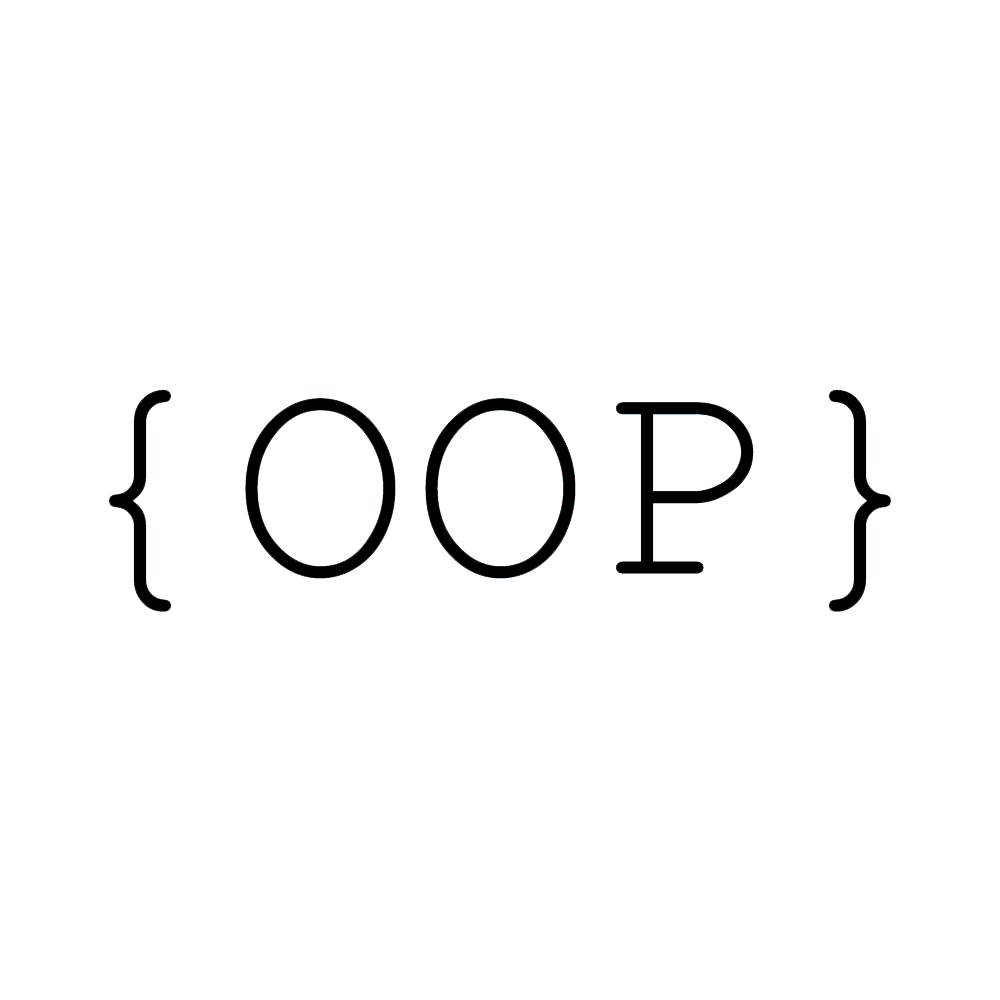

<h2 align="left">Hi 👋! My name is Fady Alamir and I'm a Frontend Developer (React Developer)</h2>

###

  
  

###

###

  
  
  
  
  
  
  
  
  
  
  
@@ -34,20 +30,22 @@
  
  
  
  
  
  
  
  
  
  
  
  
  
  
  
  
  
  
  
  
  
  

###

    
  
  
    
  

###

 

###
